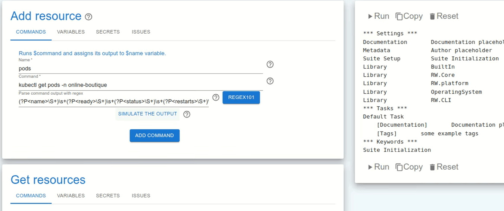
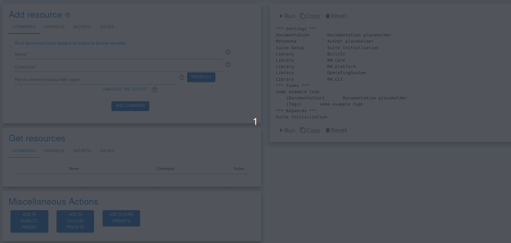
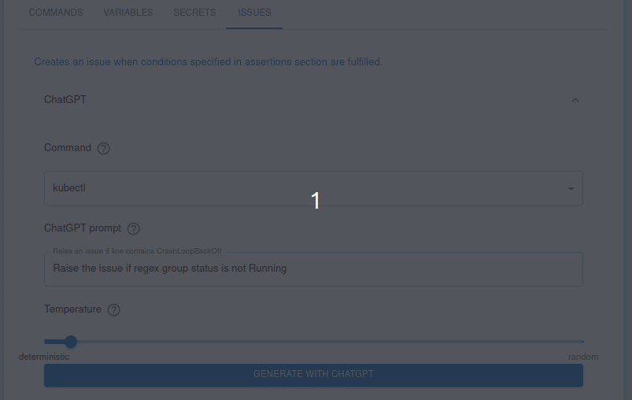
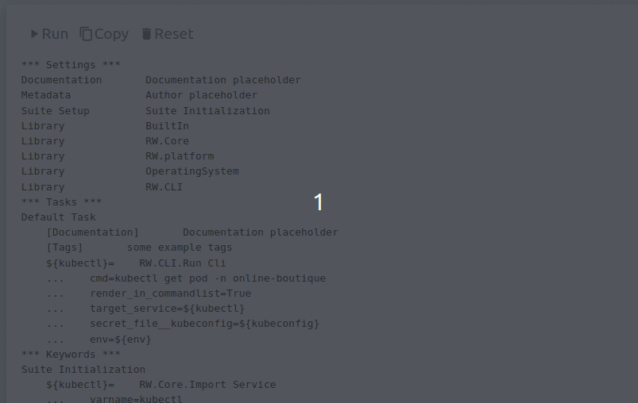
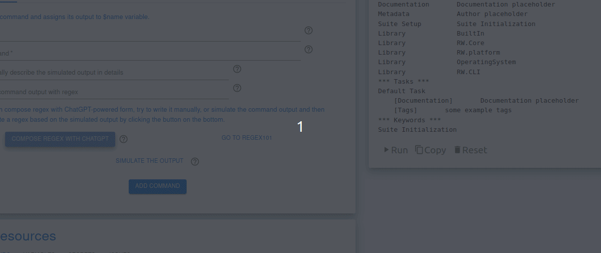
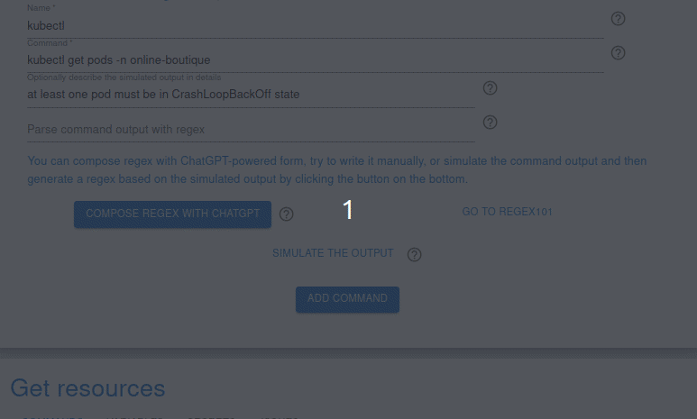

# Codebundle generator


Codebundle Generator is the easiest way to generate your Robot Framework based [CLI Codebundles](https://docs.runwhen.com/public/runwhen-platform/code-bundles). 
[Get some examples here](https://github.com/runwhen-contrib/rw-cli-codecollection). with a user-friendly web interface. 

Supercharged by ChatGPT.

# Disclaimer
This is only a simple prototype, the code is untested and unstable. Workspace state is ephemeral. Inputs are not validated.

# Table of Contents
* [Features](#Features)
* [Functionalities](#Functionalities)
* [Coming soon](#Coming-soon)
* [Installation guide](#Installation-guide)
* [Features suggestions](#Features-suggestions)
* [License](#License)

# Features
## Codebundles generation made even easier
Writing Codebundles using Robot framework [is very easy and intuitive](https://robocorp.com/docs/languages-and-frameworks/robot-framework/cheat-sheet). But why not to use GUI to save some time familiarizing with the syntax and exploring Keywords documentation. Don't burn your time on writing everything from scrach. Turn your ideas into codebundles quickly, and tune them later! 
### Command and conquer - add CLI commands to your codebundles with a single click.
</img>

Supercharge your productivity, simulate commands output and test your regexes.

### Instant boilerplate generation
</img>

Use presets to prepare your workspace and focus on what delivers the actual value.

### Use natural language to describe issues
Simply describe conditions when the issue should be raised. Review and submit the response.

</img>

## Test generated codebundles in the browser
</img>

Local codecollection development environment integration. Try it, run dev environment from this branch [generator api](https://github.com/Peikae3IWaeG/rw-cli-codecollection/tree/generator-api-m1#running-api) follow readme instructions and click on ▶️ button in Codebundle Generator web UI.

## Make AI guess your regex
</img>

Click on `guess regex` button and enjoy the magic. 

## Compose your own regexes
</img>

Use natural language to describe the regex you need.

## Adjust simulated output
</img>

Impact the simulated output by describing the expected content.
# Functionalities
## Tasks 
* User can operate within a single task
## Commands
* Adding command
* Simulating command output
* Parsing command with a regex
* Listing and removing commands from the workspace
* Guessing a regex based on the simulated command output
* Generating regex based on natural language description

## Variables/Secrets
* Creating and deleting variables and secrets 

## Raising Issues 
* Describing raise issue conditions in a natural language
* Using form to generate an issue
* Raising issues based on the previously defined commands results 
* [Stdout parser support](https://github.com/runwhen-contrib/rw-cli-codecollection/blob/main/libraries/RW/CLI/stdout_parser.py)

## Devtools integration
* running generated robot files in the UI
# Coming soon
* More LLM-based features
# Installation guide
## Clone repository 
```bash
git clone git@github.com:Peikae3IWaeG/robotgen.git
cd robotgen
```
## Docker
### Create .env file and set your OpenAI api key
```bash
cp .env.example .env
```

### Build and run containers
```bash
docker compose up
```
Docker compose setup supports hot code reload.

## Local
### Requirements
* Python 3.10 (virtual environment recommended)
* NodeJS 18
### API
```bash
cd back
pip install -r requirements.txt
OPENAI_API_KEY="sk-xxxxxxxxxxxxxxxxxxxxxxxxxxxxxxxxxxxxxxxxxxxxxxxx" DEV_API_URL="http://dev-api:8001" python main.py
```
### Frontend
```bash
cd front
npm install 
npm run dev
```

## Devtools integration
Codebundle generator needs network access to devtools container. The url is configured with `DEV_API_URL` and is set to `http://dev-api:8001` by default. Following steps are required to use devtools integration feature:
* Clone [this](https://github.com/Peikae3IWaeG/codecollection-devtools/tree/generator-api-m1) repository and switch to `generator-api-m1` branch.
* Build the docker image.
* Open your [codecollection repository](https://github.com/runwhen-contrib/rw-cli-codecollection), replace `Dockerfile` `FROM` image with the one built in the previous step, and build the image.
* Run the devlopment environment using following command `docker run --name dev-api --network robotgen_default --rm  -p 8001:8001 -v $PWD:/app/codecollection -v $PWD/auth:/app/auth --env-file .env REPLACE_ME`. Container name matches the devault value of `DEV_API_URL` environment variable. `robotgen_default` network matches network created by running compose file from this repository and provides network access for codebundle generator API to codecollection development environment. Replace `REPLACE_ME` with tag/sha of the image built in codecollection repository (previous step)

There's no progres bar/spinner when running a codebundle in the WebUI. If unsure, investigate the development environment container logs. 
## Open application
### UI http://127.0.0.1:3127
### API http://127.0.0.1:5127 (swagger generated web ui api docs)

# Features suggestions 
Feel free to open a discussion and tell me about features you'd like to see.
# License 
This software is distributed under Apache 2.0 License.
